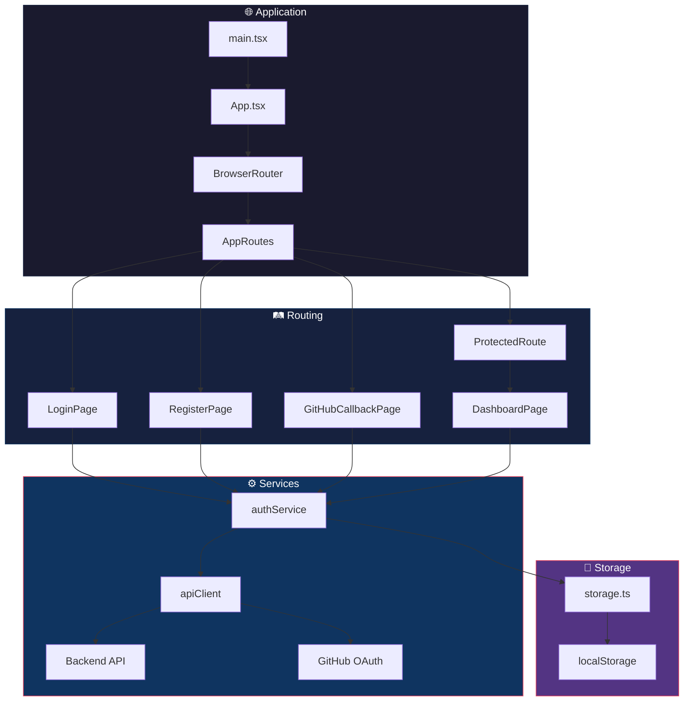
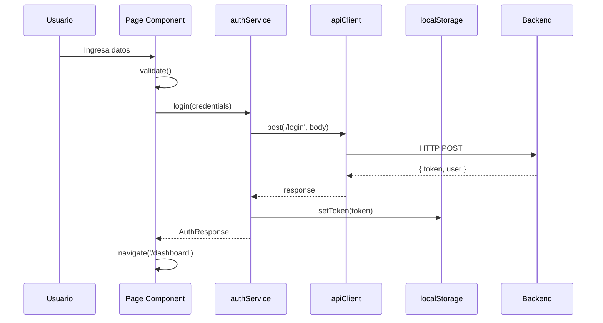
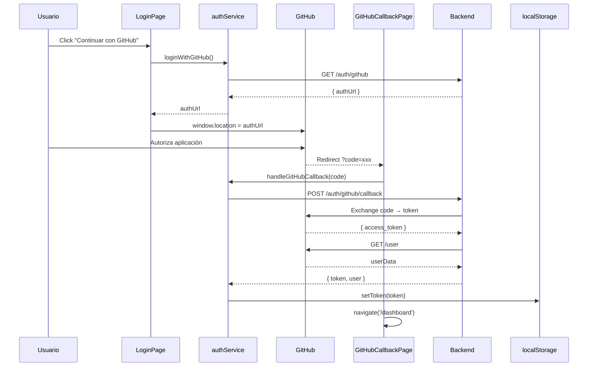

<picture>
  <source media="(prefers-color-scheme: dark)" srcset="https://capsule-render.vercel.app/api?type=waving&color=gradient&customColorList=24,25,26,27,28&height=180&section=header&text=Frontend%20App&fontSize=50&fontColor=fff&animation=scaleIn&fontAlignY=35&desc=React%20%2B%20Vite%20%2B%20TypeScript&descSize=18&descAlignY=55">
  <source media="(prefers-color-scheme: light)" srcset="https://capsule-render.vercel.app/api?type=waving&color=gradient&customColorList=24,25,26,27,28&height=180&section=header&text=Frontend%20App&fontSize=50&fontColor=fff&animation=scaleIn&fontAlignY=35&desc=React%20%2B%20Vite%20%2B%20TypeScript&descSize=18&descAlignY=55">
  
</picture>

<div align="center">

[](https://react.dev/)
[](https://vitejs.dev/)
[](https://www.typescriptlang.org/)
[](https://reactrouter.com/)

[](https://docs.github.com/en/developers/apps/building-oauth-apps)
[](https://developer.mozilla.org/en-US/docs/Web/CSS)
[](https://eslint.org/)
[](../LICENSE)

<br/>

**Aplicación SPA moderna con autenticación local y OAuth 2.0 (GitHub), rutas protegidas y diseño responsive para la gestión de sesiones de usuario**

[Características](#-características) •
[Arquitectura](#-arquitectura) •
[Instalación](#-instalación) •
[Componentes](#-componentes) •
[Documentación](#-documentación-de-archivos)

</div>

---

## 🚀 Características

<table>
<tr>
<td width="50%">

### 🔐 Autenticación
- **Login Local** - Email y contraseña
- **GitHub OAuth** - Autenticación social
- **JWT Storage** - Token en localStorage
- **Protected Routes** - HOC de verificación

</td>
<td width="50%">

### 🐙 OAuth 2.0
- **GitHub Integration** - Login con un click
- **Callback Handler** - Gestión de redirecciones
- **Estado de Carga** - UX durante autenticación
- **Error Handling** - Manejo de errores OAuth

</td>
</tr>
<tr>
<td width="50%">

### 🎨 UI/UX
- **Diseño Responsive** - Mobile-first approach
- **Design Tokens** - Variables CSS centralizadas
- **Animaciones** - Transiciones suaves
- **Accesibilidad** - WCAG 2.1 AA compliant

</td>
<td width="50%">

### 🛠️ Developer Experience
- **TypeScript** - Type safety completo
- **ESLint** - Linting configurado
- **Path Aliases** - Imports limpios
- **Hot Reload** - Desarrollo ágil

</td>
</tr>
</table>

---

## 🏗️ Arquitectura



### 📁 Estructura del Proyecto

```
frontend/
│
├── 📂 src/
│   ├── 📄 main.tsx                 # Entry point de React
│   ├── 📄 App.tsx                  # Componente raíz
│   ├── 📄 App.css                  # Estilos globales de App
│   ├── 📄 index.css                # Reset y estilos base
│   │
│   ├── 📂 api/
│   │   └── 📄 client.ts            # Cliente HTTP configurado
│   │
│   ├── 📂 app/
│   │   ├── 📄 AppRoutes.tsx        # Configuración de rutas
│   │   └── 📄 ProtectedRoute.tsx   # HOC para rutas privadas
│   │
│   ├── 📂 components/
│   │   └── 📂 ui/
│   │       ├── 📄 Alert.tsx        # Componente de alertas
│   │       ├── 📄 Button.tsx       # Botón reutilizable
│   │       ├── 📄 TextInput.tsx    # Input con validación
│   │       ├── 📄 AuthLayout.tsx   # Layout de autenticación
│   │       └── 📄 index.ts         # Barrel exports
│   │
│   ├── 📂 features/
│   │   └── 📂 auth/
│   │       ├── 📂 pages/
│   │       │   ├── 📄 LoginPage.tsx         # Login local + botón GitHub
│   │       │   ├── 📄 RegisterPage.tsx
│   │       │   ├── 📄 GitHubCallbackPage.tsx # Handler OAuth callback
│   │       │   └── 📄 DashboardPage.tsx
│   │       ├── 📂 services/
│   │       │   └── 📄 authService.ts        # Auth local + GitHub OAuth
│   │       └── 📂 types/
│   │           └── 📄 index.ts
│   │
│   ├── 📂 styles/
│   │   ├── 📄 globals.css          # Estilos globales
│   │   └── 📄 tokens.css           # Design tokens
│   │
│   └── 📂 utils/
│       ├── 📄 storage.ts           # Helpers localStorage
│       └── 📄 validation.ts        # Funciones validación
│
├── 📄 index.html                   # HTML template
├── 📄 vite.config.ts               # Configuración Vite
├── 📄 tsconfig.json                # Configuración TypeScript
├── 📄 eslint.config.js             # Configuración ESLint
└── 📄 package.json
```

---

## 📦 Instalación

### Requisitos

| Dependencia | Versión |
|-------------|---------|
| Node.js | ≥ 18.0.0 |
| npm | ≥ 9.0.0 |

### Configuración

```bash
# 1. Navegar al directorio
cd frontend

# 2. Instalar dependencias
npm install

# 3. Iniciar en desarrollo
npm run dev

# 4. Build de producción
npm run build

# 5. Preview del build
npm run preview
```

### Scripts Disponibles

| Script | Descripción |
|--------|-------------|
| `npm run dev` | Servidor de desarrollo con HMR |
| `npm run build` | Compilación TypeScript + Build Vite |
| `npm run preview` | Preview del build de producción |
| `npm run lint` | Ejecutar ESLint |

---

## 🧩 Componentes

### Componentes UI Reutilizables

<table>
<tr>
<td width="33%">

#### 🔘 Button
```tsx
<Button 
  type="submit"
  variant="primary"
  fullWidth
  isLoading={loading}
>
  Enviar
</Button>
```

</td>
<td width="33%">

#### 📝 TextInput
```tsx
<TextInput
  label="Email"
  type="email"
  value={email}
  onChange={handleChange}
  error={errors.email}
  required
/>
```

</td>
<td width="33%">

#### ⚠️ Alert
```tsx
<Alert
  type="error"
  message="Credenciales inválidas"
  onClose={() => setError('')}
/>
```

</td>
</tr>
</table>

### Páginas

| Página | Ruta | Protegida | Descripción |
|--------|------|:---------:|-------------|
| `LoginPage` | `/login` | ❌ | Formulario de inicio de sesión + botón GitHub OAuth |
| `RegisterPage` | `/register` | ❌ | Formulario de registro con confirmación de contraseña |
| `GitHubCallbackPage` | `/auth/github/callback` | ❌ | Procesa el callback de GitHub OAuth |
| `DashboardPage` | `/dashboard` | ✅ | Panel principal del usuario (local o GitHub) |

---

## 📋 Documentación de Archivos

### `src/main.tsx`
**Entry point de la aplicación React**

```typescript
// Responsabilidades:
// - Importar estilos globales
// - Renderizar App en el DOM
// - Configurar StrictMode para desarrollo
```

---

### `src/App.tsx`
**Componente raíz de la aplicación**

```typescript
// Responsabilidades:
// - Envolver la app con BrowserRouter
// - Renderizar AppRoutes
// - Punto central de providers
```

---

### `src/api/client.ts`
**Cliente HTTP para comunicación con el backend**

| Función | Descripción Técnica |
|---------|---------------------|
| `post<T>(endpoint, body)` | Realiza petición POST, inyecta Authorization header si existe token, maneja errores de conexión |
| `get<T>(endpoint)` | Realiza petición GET con token de autorización |
| `getAuthToken()` | Helper interno para obtener token de localStorage |

**Configuración:**
- Base URL: `http://localhost:3001/api`
- Content-Type: `application/json`
- Authorization: `Bearer <token>`

---

### `src/app/AppRoutes.tsx`
**Configuración del sistema de rutas (incluye OAuth callback)**

```typescript
// Rutas definidas:
// "/" → Redirect a /login
// "/login" → LoginPage (con botón GitHub)
// "/register" → RegisterPage
// "/auth/github/callback" → GitHubCallbackPage (OAuth handler)
// "/dashboard" → ProtectedRoute → DashboardPage
// "*" → Redirect a /login
```

---

### `src/app/ProtectedRoute.tsx`
**Higher-Order Component para rutas protegidas**

```typescript
// Flujo:
// 1. Verifica existencia de token con hasToken()
// 2. Si no hay token → Navigate to /login
// 3. Si hay token → Renderiza children
```

---

### `src/features/auth/services/authService.ts`
**Servicio de autenticación (local + GitHub OAuth)**

| Método | Descripción Técnica |
|--------|---------------------|
| `login(credentials)` | POST /login, guarda token en localStorage, retorna respuesta |
| `register(data)` | POST /register, NO guarda token (usuario debe hacer login) |
| `logout()` | POST /logout con token, limpia localStorage siempre (incluso si falla) |
| `loginWithGitHub()` | GET /auth/github, retorna URL de autorización de GitHub |
| `handleGitHubCallback(code)` | POST /auth/github/callback, intercambia código por JWT |
| `getGitHubUser()` | Obtiene datos del usuario GitHub autenticado |

---

### `src/features/auth/pages/LoginPage.tsx`
**Página de inicio de sesión con autenticación local y GitHub OAuth**

| Estado | Tipo | Descripción |
|--------|------|-------------|
| `email` | `string` | Valor del input email |
| `password` | `string` | Valor del input password |
| `errors` | `object` | Errores de validación por campo |
| `apiError` | `string` | Error de la API |
| `isLoading` | `boolean` | Estado de carga |

**Funciones:**
- `validate()` - Validación de campos antes de submit
- `handleSubmit()` - Llama authService.login y navega a /dashboard
- `handleGitHubLogin()` - Obtiene URL de GitHub y redirige al usuario

---

### `src/features/auth/pages/GitHubCallbackPage.tsx`
**Página de callback para GitHub OAuth**

| Estado | Tipo | Descripción |
|--------|------|-------------|
| `status` | `'loading' \| 'success' \| 'error'` | Estado del proceso OAuth |
| `errorMessage` | `string` | Mensaje de error si falla |

**Flujo:**
1. Extrae el parámetro `code` de la URL
2. Envía el código al backend via `authService.handleGitHubCallback()`
3. Si éxito: guarda token y redirige a `/dashboard`
4. Si error: muestra mensaje y enlace a `/login`

**Protección contra doble llamada:**
- Usa `useRef` para evitar llamadas duplicadas en React StrictMode

---

### `src/features/auth/pages/RegisterPage.tsx`
**Página de registro de usuarios**

| Validación | Mensaje |
|------------|---------|
| Email vacío | "El email es requerido" |
| Email inválido | "El formato del email no es válido" |
| Password vacío | "La contraseña es requerida" |
| Password < 6 chars | "La contraseña debe tener al menos 6 caracteres" |

---

### `src/features/auth/pages/DashboardPage.tsx`
**Panel principal del usuario autenticado (local o GitHub)**

```typescript
// Características:
// - Obtiene datos del usuario via GET /me
// - Detecta tipo de usuario (local vs GitHub)
// - Muestra avatar y username para usuarios GitHub
// - Muestra badge "GitHub" para usuarios OAuth
// - Botón de logout que llama authService.logout()
// - Sidebar con navegación
// - Cards de estadísticas y destinos
```

---

### `src/utils/storage.ts`
**Helpers para operaciones con localStorage**

| Función | Descripción |
|---------|-------------|
| `getToken()` | Retorna token o null |
| `setToken(token)` | Guarda token en localStorage |
| `clearToken()` | Elimina token de localStorage |
| `hasToken()` | Retorna boolean si existe token |

**Constante:** `TOKEN_KEY = 'auth_token'`

---

### `src/utils/validation.ts`
**Funciones de validación reutilizables**

| Función | Regex/Lógica |
|---------|--------------|
| `validateEmail(email)` | `/^[^\s@]+@[^\s@]+\.[^\s@]+$/` |
| `validateRequired(value)` | `value.trim().length > 0` |
| `validatePassword(password)` | `password.length >= 6` |

---

### `src/features/auth/types/index.ts`
**Definiciones de tipos TypeScript (incluye GitHub OAuth)**

```typescript
interface LoginRequest {
  email: string;
  password: string;
}

interface RegisterRequest {
  email: string;
  password: string;
}

interface AuthResponse {
  token: string;
  id?: number;
}

interface User {
  email: string;
}

// GitHub OAuth Types
interface GitHubAuthUrlResponse {
  authUrl: string;
}

interface GitHubCallbackRequest {
  code: string;
}

interface GitHubUser {
  id: string;
  githubId: number;
  username: string;
  email: string | null;
  avatarUrl: string;
  provider: 'github';
}
```

---

### `src/styles/tokens.css`
**Design tokens centralizados**

```css
:root {
  /* Colors */
  --color-primary: #...;
  --color-secondary: #...;
  --color-error: #...;
  --color-success: #...;
  
  /* Spacing */
  --spacing-xs: 0.25rem;
  --spacing-sm: 0.5rem;
  /* ... */
  
  /* Typography */
  --font-family: 'Inter', sans-serif;
  /* ... */
}
```

---

## 🔄 Flujo de Datos

### Autenticación Local


### Autenticación GitHub OAuth


---

## 👨‍💻 Autor

<div align="center">


### **Rodrigo Sánchez**
#### Full Stack Developer

<br/>

[](https://sanchezdev.com/)
[](mailto:Rodrigo@sanchezdev.com)

[](https://www.linkedin.com/in/sanchezdev)
[](https://www.sanchezdev.com/documents/CV-Espanol.html)

[](https://www.sanchezdev.com/es/agenda)

<br/>

*¿Tienes una idea de proyecto? Conversemos cómo puedo ayudarte.*

</div>

---

## 📄 Licencia

Este proyecto está bajo la Licencia MIT. Consulta el archivo [LICENSE](../LICENSE) para más detalles.

---

<picture>
  <source media="(prefers-color-scheme: dark)" srcset="https://capsule-render.vercel.app/api?type=waving&color=gradient&customColorList=24,25,26,27,28&height=120&section=footer">
  <source media="(prefers-color-scheme: light)" srcset="https://capsule-render.vercel.app/api?type=waving&color=gradient&customColorList=24,25,26,27,28&height=120&section=footer">
  
</picture>
